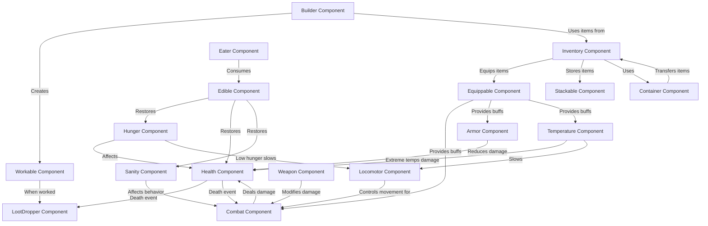

*Last Update: 2023-07-06*
# Component Interactions and Data Flow

*API Version: 619045*

This document provides a comprehensive overview of how components interact with each other in Don't Starve Together's API. Understanding these interactions is crucial for effective modding and creating complex entity behaviors.

## Core Component Data Flow

The diagram below illustrates the primary data flow between core components in Don't Starve Together:



## Key Interaction Patterns

### Combat and Health System

The combat system involves several components working together:

1. **Combat → Health**: The Combat component calculates damage and applies it to the target's Health component
2. **Weapon → Combat**: Weapons modify the damage output of the Combat component
3. **Armor → Health**: Armor reduces damage received by the Health component
4. **Health → LootDropper**: When health reaches zero, the death event triggers the LootDropper

```lua
-- Example: Combat dealing damage to Health
function Combat:DoAttack(target)
    if target.components.health ~= nil then
        local damage = self:CalcDamage(target)
        target.components.health:DoDelta(-damage)
        
        if target.components.health:IsDead() then
            self:OnKill(target)
        end
    end
end
```

### Inventory and Item System

The inventory system manages items and their effects:

1. **Inventory → Equippable**: The Inventory component equips items with the Equippable component
2. **Equippable → Various**: Equipped items provide buffs to various components
3. **Container ↔ Inventory**: Containers store items and transfer them to/from inventory
4. **Stackable → Inventory**: Stackable items optimize inventory space

```lua
-- Example: Inventory equipping an item
function Inventory:Equip(item)
    if item.components.equippable ~= nil then
        local eslot = item.components.equippable.equipslot
        local old_item = self:GetEquippedItem(eslot)
        
        if old_item ~= nil then
            self:Unequip(eslot)
        end
        
        item.components.equippable:OnEquip(self.inst)
        self.equipslots[eslot] = item
        self.inst:PushEvent("equipped", {item = item, eslot = eslot})
    end
end
```

### Survival System

The survival system manages the character's vital stats:

1. **Hunger → Health**: Hunger affects health regeneration and can cause damage when empty
2. **Temperature → Health**: Extreme temperatures cause damage via the Health component
3. **Edible → Various**: Food items affect Hunger, Health, and Sanity components
4. **Eater → Edible**: The Eater component consumes items with the Edible component

```lua
-- Example: Temperature causing damage to Health
function Temperature:DoHurtRateUpdate(dt)
    if self.inst.components.health ~= nil then
        if self:IsFreezing() then
            self.inst.components.health:DoDelta(-self.hurtrate * dt, false, "cold")
        elseif self:IsOverheating() then
            self.inst.components.health:DoDelta(-self.overheathurtrate * dt, false, "heat")
        end
    end
end
```

### Resource and Crafting System

The resource system handles gathering and crafting:

1. **Workable → LootDropper**: Working on objects (chopping, mining) triggers the LootDropper
2. **Builder → Inventory**: The Builder component uses items from the Inventory for crafting
3. **Builder → Prefabs**: The Builder creates new entities based on recipes

```lua
-- Example: Builder crafting an item
function Builder:DoBuild(recname, pt, rotation, skin)
    local recipe = GetRecipe(recname)
    if recipe then
        if recipe.placer == nil or self:IsBuildBuffered(recname) or self:CanBuild(recname) then
            self:RemoveIngredients(recipe)
            local prod = SpawnPrefab(recipe.product, recipe.productdata, skin)
            if prod then
                -- Position and configure the crafted item
                prod.Transform:SetPosition(pt:Get())
                self.inst:PushEvent("builditem", {item=prod, recipe=recipe})
                return prod
            end
        end
    end
    return nil
end
```

## Event-Based Communication

Many component interactions are event-driven rather than direct function calls. This decouples components and allows for more flexible behavior:

```lua
-- Component A triggers an event
self.inst:PushEvent("attacked", {attacker = attacker, damage = damage})

-- Component B listens for the event
self.inst:ListenForEvent("attacked", function(inst, data)
    -- React to the event
    print("Attacked by " .. data.attacker.name .. " for " .. data.damage .. " damage")
end)
```

Common events that facilitate component communication include:
- `death`: Triggered when an entity dies
- `attacked`: Triggered when an entity is attacked
- `healthdelta`: Triggered when health changes
- `equip`/`unequip`: Triggered when items are equipped/unequipped
- `itemget`/`itemlose`: Triggered when items are added/removed from inventory

## Event-Based Component Communication Examples

Events are the primary way components communicate with each other without creating tight coupling. This section provides detailed examples of how different components use events to interact.

### Example 1: Health and State Graph Communication

When an entity takes damage, the Health component broadcasts events that the State Graph can react to for animations and sound effects:

```lua
-- In the Health component
function Health:DoDelta(amount, overtime, cause, ignore_invincible, afflicter, ignore_absorb)
    -- Calculate actual damage/healing
    local old_percent = self:GetPercent()
    
    -- Apply health change
    self.currenthealth = math.clamp(self.currenthealth + amount, 0, self.maxhealth)
    
    -- Broadcast the health change event
    self.inst:PushEvent("healthdelta", {
        oldpercent = old_percent,
        newpercent = self:GetPercent(),
        amount = amount,
        overtime = overtime,
        cause = cause,
        afflicter = afflicter,
    })
    
    -- Check for death
    if self.currenthealth <= 0 then
        self.inst:PushEvent("death", {
            cause = cause,
            afflicter = afflicter,
        })
    end
end

-- In a State Graph
local states = {
    State{
        name = "idle",
        onenter = function(inst)
            inst.AnimState:PlayAnimation("idle_loop", true)
        end,
    },
    
    State{
        name = "hit",
        onenter = function(inst)
            inst.AnimState:PlayAnimation("hit")
            inst.SoundEmitter:PlaySound("dontstarve/creatures/generic_hit")
        end,
        
        events = {
            EventHandler("animover", function(inst)
                inst.sg:GoToState("idle")
            end),
        },
    }
}

-- Connect the health event to the state graph
local function SetupStateGraph(inst)
    inst:ListenForEvent("healthdelta", function(inst, data)
        if data.amount < 0 and not data.overtime then
            -- Only react to direct damage, not damage over time
            inst.sg:GoToState("hit")
        end
    end)
end
```

### Example 2: Hunger and Sanity Interaction via Events

Hunger can affect sanity through events, creating interconnected survival mechanics:

```lua
-- In the Hunger component
function Hunger:DoDelta(delta, overtime)
    local old = self.current
    self.current = math.clamp(self.current + delta, 0, self.max)
    
    -- Broadcast hunger change event
    self.inst:PushEvent("hungerdelta", {
        oldpercent = old / self.max,
        newpercent = self.current / self.max,
        delta = self.current - old,
        overtime = overtime,
    })
    
    -- Check for extreme hunger
    if old > 0 and self.current <= 0 then
        self.inst:PushEvent("startstarving")
        self.inst:StartUpdatingComponent(self)
    elseif old <= 0 and self.current > 0 then
        self.inst:PushEvent("stopstarving")
    end
end

-- In the Sanity component, listen for hunger events
local function ConnectHungerToSanity(inst)
    -- Lose sanity when starving
    inst:ListenForEvent("startstarving", function(inst)
        if inst.components.sanity ~= nil then
            -- Start losing sanity due to starvation
            inst.components.sanity.external_penalties.hunger = TUNING.SANITY_STARVE_PENALTY
            inst.components.sanity:RecalculatePenalty()
        end
    end)
    
    -- Stop losing sanity when no longer starving
    inst:ListenForEvent("stopstarving", function(inst)
        if inst.components.sanity ~= nil then
            -- Remove starvation sanity penalty
            inst.components.sanity.external_penalties.hunger = 0
            inst.components.sanity:RecalculatePenalty()
        end
    end)
end
```

### Example 3: Inventory Changes Affecting Equipment Stats

When items are added or removed from inventory, events can trigger updates to player stats:

```lua
-- In a mod that adds a backpack with speed bonus
local function MakeSpeedBackpack()
    local inst = CreateEntity()
    
    -- Add basic components
    inst:AddComponent("inventoryitem")
    inst:AddComponent("equippable")
    inst.components.equippable.equipslot = EQUIPSLOTS.BODY
    
    -- Configure speed bonus
    inst.components.equippable.walkspeedmult = 1.25 -- 25% speed bonus
    
    return inst
end

-- Set up player to listen for equipment changes
local function SetupPlayerEquipmentListeners(inst)
    -- Track speed modifiers from equipment
    inst.equipment_speed_modifiers = {}
    
    -- Listen for equip events
    inst:ListenForEvent("equip", function(inst, data)
        local item = data.item
        local slot = data.eslot
        
        -- Check for speed modifiers
        if item.components.equippable ~= nil and item.components.equippable.walkspeedmult ~= nil then
            -- Store the speed modifier by slot
            inst.equipment_speed_modifiers[slot] = item.components.equippable.walkspeedmult
            
            -- Update locomotor speed if present
            if inst.components.locomotor ~= nil then
                inst.components.locomotor:SetExternalSpeedMultiplier(
                    item, "equipment_speed_" .. slot, item.components.equippable.walkspeedmult
                )
            end
        end
    end)
    
    -- Listen for unequip events
    inst:ListenForEvent("unequip", function(inst, data)
        local slot = data.eslot
        
        -- Remove speed modifier for this slot
        if inst.equipment_speed_modifiers[slot] ~= nil then
            inst.equipment_speed_modifiers[slot] = nil
            
            -- Update locomotor speed if present
            if inst.components.locomotor ~= nil then
                inst.components.locomotor:RemoveExternalSpeedMultiplier(
                    data.item, "equipment_speed_" .. slot
                )
            end
        end
    end)
end
```

### Example 4: Weather Events Affecting Multiple Components

Weather changes can trigger events that affect multiple components simultaneously:

```lua
-- In the Weather component
function Weather:StartSnowing()
    if not self.snow then
        self.snow = true
        TheWorld:PushEvent("snowstart")
    end
end

function Weather:StopSnowing()
    if self.snow then
        self.snow = false
        TheWorld:PushEvent("snowstop")
    end
end

-- Different components can react to the same weather events
local function SetupWeatherReactions(inst)
    -- Temperature component reacts to snow
    inst:ListenForEvent("snowstart", function(world)
        if inst.components.temperature ~= nil then
            -- Snow makes the environment colder
            inst.components.temperature.current_temp_modifier = -5
        end
    end, TheWorld)
    
    inst:ListenForEvent("snowstop", function(world)
        if inst.components.temperature ~= nil then
            -- Remove cold modifier when snow stops
            inst.components.temperature.current_temp_modifier = 0
        end
    end, TheWorld)
    
    -- Locomotor component reacts to snow
    inst:ListenForEvent("snowstart", function(world)
        if inst.components.locomotor ~= nil then
            -- Snow slows movement
            inst.components.locomotor:SetExternalSpeedMultiplier(inst, "snow", 0.8)
        end
    end, TheWorld)
    
    inst:ListenForEvent("snowstop", function(world)
        if inst.components.locomotor ~= nil then
            -- Remove speed penalty when snow stops
            inst.components.locomotor:RemoveExternalSpeedMultiplier(inst, "snow")
        end
    end, TheWorld)
    
    -- Crop component reacts to snow
    inst:ListenForEvent("snowstart", function(world)
        if inst.components.crop ~= nil then
            -- Snow pauses crop growth
            inst.components.crop:Pause()
        end
    end, TheWorld)
    
    inst:ListenForEvent("snowstop", function(world)
        if inst.components.crop ~= nil then
            -- Resume crop growth when snow stops
            inst.components.crop:Resume()
        end
    end, TheWorld)
}
```

### Example 5: Component Communication via Custom Events

Components can define and use custom events for specialized communication:

```lua
-- In a custom sanity aura component
local SanityAura = Class(function(self, inst)
    self.inst = inst
    self.aura = 0
    self.range = 10
    
    -- Start broadcasting the aura
    self.task = self.inst:DoPeriodicTask(1, function() self:PulseAura() end)
end)

function SanityAura:PulseAura()
    -- Find players in range
    local x, y, z = self.inst.Transform:GetWorldPosition()
    local players = TheSim:FindEntities(x, y, z, self.range, {"player"})
    
    -- Broadcast custom aura event to nearby players
    for _, player in ipairs(players) do
        -- Calculate distance-based intensity
        local px, py, pz = player.Transform:GetWorldPosition()
        local dist = math.sqrt((x - px)^2 + (z - pz)^2)
        local intensity = math.max(0, 1 - (dist / self.range)) * self.aura
        
        -- Send the custom event to the player
        player:PushEvent("sanityadjustment", {
            amount = intensity,
            source = self.inst,
            sanityaura = true
        })
    end
end

-- In the sanity component, listen for the custom event
function Sanity:OnUpdate(dt)
    -- Process any sanity aura events received
    self.inst:ListenForEvent("sanityadjustment", function(inst, data)
        if data.sanityaura and data.amount ~= 0 then
            -- Apply the sanity change from the aura
            self:DoDelta(data.amount * dt)
            
            -- Optionally track the source
            if data.amount < 0 and data.source ~= nil then
                self.inst:PushEvent("goninsane", {source = data.source})
            elseif data.amount > 0 and data.source ~= nil then
                self.inst:PushEvent("gosane", {source = data.source})
            end
        end
    end)
end
```

### Best Practices for Event-Based Communication

When using events for component communication, follow these guidelines:

1. **Use Descriptive Event Names**: Choose clear, specific names that indicate what happened
2. **Include Relevant Data**: Pass all necessary information in the event data table
3. **Avoid Circular Events**: Be careful not to create infinite loops of events triggering each other
4. **Clean Up Event Listeners**: Remove event listeners when components are removed
5. **Use Local vs. Global Events**: Choose the appropriate scope for your events

```lua
-- Example of proper event listener cleanup
function MyComponent:OnRemoveFromEntity()
    if self.eventtask ~= nil then
        self.eventtask:Cancel()
        self.eventtask = nil
    end
    
    -- Remove all event listeners this component created
    self.inst:RemoveEventCallback("attacked", self.onattacked)
    self.inst:RemoveEventCallback("death", self.ondeath)
end

-- Example of setting up event listeners with proper references
function MyComponent:OnLoad()
    -- Store references to bound callbacks for later cleanup
    self.onattacked = function(inst, data) self:OnAttacked(data) end
    self.ondeath = function(inst) self:OnDeath() end
    
    -- Add the event listeners
    self.inst:ListenForEvent("attacked", self.onattacked)
    self.inst:ListenForEvent("death", self.ondeath)
end
```

## Replication System

For multiplayer synchronization, components use a replication system:

1. **Server Components**: Full components with all logic run on the server
2. **Replica Components**: Lightweight versions that exist on clients
3. **NetVars**: Network variables that synchronize specific values

```lua
-- Server-side component
function Health:SetCurrentHealth(amount)
    self.currenthealth = amount
    self.inst.replica.health:SetCurrentHealth(amount) -- Update replica
end

-- Client-side replica
function HealthReplica:SetCurrentHealth(amount)
    self._currenthealth:set(amount) -- NetVar synchronization
end
```

## Understanding Component Dependencies

When creating mods, it's important to understand component dependencies:

1. **Required Components**: Some components require others to function correctly
   - Combat often requires Health
   - Eater often requires Hunger
   - Equippable often requires Inventoryitem

2. **Optional Interactions**: Some components enhance others but aren't required
   - Armor enhances Health but isn't required
   - Stackable enhances Inventoryitem but isn't required

Understanding these dependencies helps create more robust mods that integrate well with the existing system. 

## Health, Combat, and Inventory Interaction Examples

The following examples demonstrate how Health, Combat, and Inventory components interact in common gameplay scenarios.

### Example 1: Equipping a Weapon and Attacking

This example shows how a player equips a weapon from inventory and uses it to attack a target:

```lua
-- Create a basic weapon
local function CreateWeapon(damage)
    local weapon = CreateEntity()
    
    -- Add required components
    weapon:AddComponent("inventoryitem")
    weapon:AddComponent("equippable")
    weapon:AddComponent("weapon")
    
    -- Configure components
    weapon.components.equippable.equipslot = EQUIPSLOTS.HANDS
    weapon.components.weapon:SetDamage(damage)
    
    return weapon
end

-- Create a player with inventory and combat
local function CreatePlayer()
    local player = CreateEntity()
    
    -- Add required components
    player:AddComponent("inventory")
    player:AddComponent("health")
    player:AddComponent("combat")
    
    -- Configure components
    player.components.health:SetMaxHealth(150)
    player.components.combat:SetDefaultDamage(10) -- Base damage without weapon
    
    -- Add event listeners
    player:ListenForEvent("equip", function(inst, data)
        if data.item.components.weapon ~= nil and data.eslot == EQUIPSLOTS.HANDS then
            -- Update combat damage when equipping a weapon
            inst.components.combat.damage = data.item.components.weapon.damage
            print("Equipped weapon with " .. data.item.components.weapon.damage .. " damage")
        end
    end)
    
    player:ListenForEvent("unequip", function(inst, data)
        if data.eslot == EQUIPSLOTS.HANDS then
            -- Reset to default damage when unequipping a weapon
            inst.components.combat.damage = inst.components.combat.defaultdamage
            print("Unequipped weapon, reverting to " .. inst.components.combat.defaultdamage .. " damage")
        end
    end)
    
    return player
end

-- Create a target with health
local function CreateTarget()
    local target = CreateEntity()
    
    -- Add required components
    target:AddComponent("health")
    
    -- Configure components
    target.components.health:SetMaxHealth(100)
    
    -- Add event listeners
    target:ListenForEvent("healthdelta", function(inst, data)
        print("Target health changed by " .. data.amount .. " (now at " .. 
              inst.components.health:GetPercent() * 100 .. "%)")
    end)
    
    target:ListenForEvent("death", function(inst)
        print("Target has died!")
    end)
    
    return target
end

-- Usage example
local function CombatExample()
    local player = CreatePlayer()
    local target = CreateTarget()
    local sword = CreateWeapon(40)
    
    -- Give weapon to player and equip it
    player.components.inventory:GiveItem(sword)
    player.components.inventory:Equip(sword)
    
    -- Player attacks target
    player.components.combat:SetTarget(target)
    player.components.combat:DoAttack()
    
    -- Unequip weapon and attack again with bare hands
    player.components.inventory:Unequip(EQUIPSLOTS.HANDS)
    player.components.combat:DoAttack()
end
```

### Example 2: Using Armor to Reduce Damage

This example shows how armor in the inventory protects a player from damage:

```lua
-- Create a basic armor
local function CreateArmor(absorption)
    local armor = CreateEntity()
    
    -- Add required components
    armor:AddComponent("inventoryitem")
    armor:AddComponent("equippable")
    armor:AddComponent("armor")
    
    -- Configure components
    armor.components.equippable.equipslot = EQUIPSLOTS.BODY
    armor.components.armor:SetAbsorption(absorption) -- 0-1 value, percentage of damage absorbed
    armor.components.armor:SetMaxCondition(100) -- Durability
    
    return armor
end

-- Create a player with inventory, health, and armor
local function CreateArmoredPlayer()
    local player = CreateEntity()
    
    -- Add required components
    player:AddComponent("inventory")
    player:AddComponent("health")
    
    -- Configure components
    player.components.health:SetMaxHealth(150)
    
    -- Add event listeners for damage
    player:ListenForEvent("attacked", function(inst, data)
        print("Player was attacked for " .. data.damage .. " damage")
        
        -- Check for armor
        local armor = inst.components.inventory:GetEquippedItem(EQUIPSLOTS.BODY)
        if armor ~= nil and armor.components.armor ~= nil then
            local absorbed_damage = data.damage * armor.components.armor.absorb_percent
            local actual_damage = data.damage - absorbed_damage
            
            print("Armor absorbed " .. absorbed_damage .. " damage")
            print("Player took " .. actual_damage .. " actual damage")
            
            -- Damage the armor
            armor.components.armor:TakeDamage(data.damage)
            print("Armor condition: " .. armor.components.armor.condition)
            
            if armor.components.armor.condition <= 0 then
                print("Armor has broken!")
            end
        else
            print("No armor equipped, took full damage")
        end
    end)
    
    return player
end

-- Usage example
local function ArmorExample()
    local player = CreateArmoredPlayer()
    local armor = CreateArmor(0.8) -- 80% damage absorption
    
    -- Give armor to player and equip it
    player.components.inventory:GiveItem(armor)
    player.components.inventory:Equip(armor)
    
    -- Simulate player taking damage with armor
    player.components.health:DoDelta(-50, false, "attack")
    
    -- Unequip armor and take damage again
    player.components.inventory:Unequip(EQUIPSLOTS.BODY)
    player.components.health:DoDelta(-50, false, "attack")
end
```

### Example 3: Healing Items in Inventory

This example demonstrates using healing items from inventory to restore health:

```lua
-- Create a healing item
local function CreateHealingItem(health_value)
    local item = CreateEntity()
    
    -- Add required components
    item:AddComponent("inventoryitem")
    item:AddComponent("healer")
    
    -- Configure healing value
    item.components.healer:SetHealthAmount(health_value)
    
    return item
end

-- Create a player with inventory and health
local function CreateInjuredPlayer()
    local player = CreateEntity()
    
    -- Add required components
    player:AddComponent("inventory")
    player:AddComponent("health")
    
    -- Configure health
    player.components.health:SetMaxHealth(100)
    player.components.health:SetPercent(0.3) -- Start at 30% health
    
    -- Add event listener for health changes
    player:ListenForEvent("healthdelta", function(inst, data)
        print("Player health changed by " .. data.amount .. " (now at " .. 
              inst.components.health:GetPercent() * 100 .. "%)")
    end)
    
    return player
end

-- Function to use a healing item
local function UseHealingItem(player, item)
    if item.components.healer ~= nil then
        -- Apply healing effect
        item.components.healer:Heal(player)
        
        -- Remove the item after use
        item:Remove()
        return true
    end
    return false
end

-- Usage example
local function HealingExample()
    local player = CreateInjuredPlayer()
    local healingItem = CreateHealingItem(50) -- Heals 50 health
    
    -- Give healing item to player
    player.components.inventory:GiveItem(healingItem)
    
    -- Use the healing item
    local item = player.components.inventory:FindItem(function(item) 
        return item.components.healer ~= nil 
    end)
    
    if item ~= nil then
        print("Using healing item...")
        UseHealingItem(player, item)
        player.components.inventory:RemoveItem(item)
    end
end
```

These examples demonstrate the core interactions between Health, Combat, and Inventory components, showing how they work together to create the combat and survival mechanics in Don't Starve Together. 

## Common Design Patterns When Working with Multiple Components

When developing mods that involve multiple components, several design patterns can help you create more maintainable and effective code. This section covers the most common patterns used in Don't Starve Together modding.

### 1. Component Composition Pattern

The component composition pattern is the foundation of Don't Starve Together's entity system. Instead of creating complex inheritance hierarchies, entities are composed of reusable components.

```lua
-- Example: Creating an entity with multiple components
local function CreateComplexEntity()
    local inst = CreateEntity()
    
    -- Add basic components
    inst:AddComponent("health")
    inst:AddComponent("combat")
    inst:AddComponent("inventory")
    inst:AddComponent("hunger")
    inst:AddComponent("sanity")
    inst:AddComponent("temperature")
    
    -- Configure components
    inst.components.health:SetMaxHealth(150)
    inst.components.combat:SetDefaultDamage(10)
    inst.components.hunger:SetMax(150)
    
    return inst
end
```

**Benefits:**
- Entities can be constructed from mix-and-match components
- Components can be added or removed dynamically
- Behavior can be modified by changing component configuration
- Easier to reuse functionality across different entity types

### 2. Component Dependency Injection

This pattern involves passing component references to other components that depend on them, rather than having components directly access each other.

```lua
-- Example: Dependency injection pattern
local MyCustomComponent = Class(function(self, inst)
    self.inst = inst
    self.damage_multiplier = 1.0
    
    -- Store references to required components
    self.health = inst.components.health
    self.combat = inst.components.combat
    
    -- Set up the component with dependencies
    if self.combat ~= nil and self.health ~= nil then
        self:Initialize()
    else
        -- Handle missing dependencies
        print("Warning: MyCustomComponent requires health and combat components")
    end
end)

function MyCustomComponent:Initialize()
    -- Use the injected component references
    self.base_damage = self.combat:GetDefaultDamage()
    self.max_health = self.health:GetMaxHealth()
    
    -- Set up event listeners
    self.inst:ListenForEvent("healthdelta", function(inst, data)
        self:OnHealthChanged(data)
    end)
end

function MyCustomComponent:OnHealthChanged(data)
    -- Adjust damage based on health percentage
    local health_percent = self.health:GetPercent()
    self.damage_multiplier = 1.0 + (1.0 - health_percent)
    self.combat:SetDefaultDamage(self.base_damage * self.damage_multiplier)
end
```

**Benefits:**
- Clear dependencies between components
- Easier to test components in isolation
- More robust when components are added or removed
- Prevents tight coupling between components

### 3. Component Observer Pattern

The observer pattern allows components to react to changes in other components without direct coupling, primarily through the event system.

```lua
-- Example: Observer pattern using events
local function SetupComponentObservers(inst)
    -- Health observes hunger
    inst:ListenForEvent("hungerdelta", function(inst, data)
        if inst.components.health ~= nil and data.newpercent <= 0 then
            -- Start taking starvation damage
            inst.components.health:StartRegen(-1, 1)
        elseif inst.components.health ~= nil and data.oldpercent <= 0 and data.newpercent > 0 then
            -- Stop starvation damage
            inst.components.health:StopRegen()
        end
    end)
    
    -- Sanity observes temperature
    inst:ListenForEvent("temperaturedelta", function(inst, data)
        if inst.components.sanity ~= nil then
            if data.new < 0 and data.old >= 0 then
                -- Start freezing, lose sanity
                inst.components.sanity:AddSanityPenalty("freezing", -0.1)
            elseif data.new >= 0 and data.old < 0 then
                -- Stop freezing, remove penalty
                inst.components.sanity:RemoveSanityPenalty("freezing")
            end
        end
    end)
    
    -- Combat observes sanity
    inst:ListenForEvent("sanitydelta", function(inst, data)
        if inst.components.combat ~= nil then
            if data.newpercent < 0.1 and data.oldpercent >= 0.1 then
                -- Very low sanity, increase damage
                inst.components.combat:AddDamageModifier("insanity", 1.5)
            elseif data.newpercent >= 0.1 and data.oldpercent < 0.1 then
                -- Sanity recovered, remove damage bonus
                inst.components.combat:RemoveDamageModifier("insanity")
            end
        end
    end)
end
```

**Benefits:**
- Components remain decoupled but can still react to each other
- Multiple components can respond to the same event
- Easy to add new observers without modifying existing code
- Events provide a standardized communication mechanism

### 4. Component Decorator Pattern

The decorator pattern extends component functionality without modifying the original component. This is often implemented by wrapping or post-initializing components.

```lua
-- Example: Decorator pattern for components
local function EnhanceHealthComponent(inst)
    if inst.components.health ~= nil then
        -- Store original functions
        local original_DoDelta = inst.components.health.DoDelta
        local original_SetMaxHealth = inst.components.health.SetMaxHealth
        
        -- Override with enhanced functionality
        inst.components.health.DoDelta = function(self, amount, overtime, cause, ...)
            -- Add custom behavior before
            if amount < 0 then
                -- Chance to avoid damage
                if math.random() < 0.2 then
                    print("Damage avoided!")
                    return 0
                end
            end
            
            -- Call original function
            return original_DoDelta(self, amount, overtime, cause, ...)
        end
        
        inst.components.health.SetMaxHealth = function(self, amount)
            -- Add custom behavior
            local bonus = math.floor(amount * 0.1)
            print("Adding health bonus: " .. bonus)
            
            -- Call original with bonus
            return original_SetMaxHealth(self, amount + bonus)
        end
        
        -- Add new functionality
        inst.components.health.GetHealthRegenRate = function(self)
            return self.regen_rate or 0
        end
    end
end
```

**Benefits:**
- Extends component functionality without modifying the original code
- Can be applied conditionally or to specific entities
- Allows for stacking multiple decorators
- Useful for mod compatibility and overriding behavior

### 5. Component Facade Pattern

The facade pattern creates a simplified interface for a group of components that commonly work together, making it easier to use them as a unified system.

```lua
-- Example: Facade pattern for survival components
local function CreateSurvivalFacade(inst)
    -- Create a facade that simplifies working with survival components
    inst.survival = {}
    
    -- Add simplified methods that coordinate multiple components
    inst.survival.GetStatus = function()
        local status = {}
        
        if inst.components.health ~= nil then
            status.health = inst.components.health:GetPercent()
        end
        
        if inst.components.hunger ~= nil then
            status.hunger = inst.components.hunger:GetPercent()
        end
        
        if inst.components.sanity ~= nil then
            status.sanity = inst.components.sanity:GetPercent()
        end
        
        if inst.components.temperature ~= nil then
            status.temperature = inst.components.temperature:GetCurrent()
        end
        
        return status
    end
    
    -- Method to restore all stats at once
    inst.survival.RestoreAll = function(amount)
        if inst.components.health ~= nil then
            inst.components.health:DoDelta(amount)
        end
        
        if inst.components.hunger ~= nil then
            inst.components.hunger:DoDelta(amount)
        end
        
        if inst.components.sanity ~= nil then
            inst.components.sanity:DoDelta(amount)
        end
    end
    
    -- Method to check if in critical condition
    inst.survival.IsCritical = function()
        local critical = false
        
        if inst.components.health ~= nil and inst.components.health:GetPercent() < 0.2 then
            critical = true
        end
        
        if inst.components.hunger ~= nil and inst.components.hunger:GetPercent() < 0.1 then
            critical = true
        end
        
        if inst.components.sanity ~= nil and inst.components.sanity:GetPercent() < 0.1 then
            critical = true
        end
        
        return critical
    end
    
    return inst.survival
end
```

**Benefits:**
- Simplifies complex component interactions
- Provides a higher-level interface for common operations
- Reduces code duplication when working with multiple components
- Makes code more readable and maintainable

### 6. Component State Machine Pattern

The state machine pattern manages complex state transitions across multiple components, often using the stategraph system in combination with components.

```lua
-- Example: State machine pattern with components
local states = {
    idle = {
        onenter = function(inst)
            -- Configure components for idle state
            if inst.components.locomotor ~= nil then
                inst.components.locomotor:Stop()
            end
            
            -- Play idle animation
            inst.AnimState:PlayAnimation("idle_loop", true)
        end
    },
    
    attack = {
        onenter = function(inst)
            -- Configure components for attack state
            if inst.components.combat ~= nil then
                inst.components.combat:StartAttack()
            end
            
            -- Play attack animation
            inst.AnimState:PlayAnimation("attack")
        end,
        
        onexit = function(inst)
            -- Clean up attack state
            if inst.components.combat ~= nil then
                inst.components.combat:StopAttack()
            end
        end,
        
        events = {
            EventHandler("animover", function(inst)
                -- Transition back to idle when animation finishes
                inst.sg:GoToState("idle")
            end)
        }
    },
    
    hurt = {
        onenter = function(inst)
            -- Configure components for hurt state
            if inst.components.locomotor ~= nil then
                inst.components.locomotor:Stop()
            end
            
            -- Play hurt animation
            inst.AnimState:PlayAnimation("hit")
        end,
        
        events = {
            EventHandler("animover", function(inst)
                -- Transition back to idle when animation finishes
                inst.sg:GoToState("idle")
            end)
        }
    }
}

local function SetupStateMachine(inst)
    -- Create state graph
    inst:SetStateGraph("SGmyentity")
    
    -- Connect component events to state transitions
    inst:ListenForEvent("attacked", function(inst)
        if not inst.sg:HasStateTag("busy") then
            inst.sg:GoToState("hurt")
        end
    end)
    
    inst:ListenForEvent("doattack", function(inst)
        if not inst.sg:HasStateTag("busy") then
            inst.sg:GoToState("attack")
        end
    end)
end
```

**Benefits:**
- Manages complex state transitions across multiple components
- Centralizes animation and component state management
- Prevents conflicts between competing component behaviors
- Creates predictable entity behavior

### 7. Component Proxy Pattern

The proxy pattern provides a controlled interface to component functionality, often used to add validation, logging, or conditional access.

```lua
-- Example: Proxy pattern for component access
local function CreateHealthProxy(inst)
    local health = inst.components.health
    local health_proxy = {}
    
    -- Create proxy methods with additional functionality
    health_proxy.DoDelta = function(amount, overtime, cause)
        -- Add validation
        if amount == nil then
            print("Warning: Tried to change health with nil amount")
            return
        end
        
        -- Add logging
        print("Health changing by " .. amount .. " due to " .. (cause or "unknown"))
        
        -- Add conditional logic
        if amount < 0 and inst:HasTag("invulnerable") then
            print("Blocked damage due to invulnerability")
            return 0
        end
        
        -- Call the actual component method
        return health:DoDelta(amount, overtime, cause)
    end
    
    health_proxy.GetCurrent = function()
        return health.currenthealth
    end
    
    health_proxy.GetMax = function()
        return health.maxhealth
    end
    
    health_proxy.GetPercent = function()
        return health:GetPercent()
    end
    
    health_proxy.IsInvincible = function()
        return health:IsInvincible()
    end
    
    return health_proxy
end
```

**Benefits:**
- Adds validation, logging, or conditional logic to component access
- Can restrict or modify component functionality
- Useful for debugging and monitoring component usage
- Can implement caching or lazy initialization

By understanding and applying these design patterns, you can create more robust and maintainable mods that effectively leverage Don't Starve Together's component-based architecture. 
