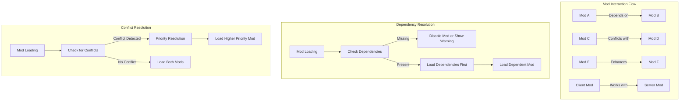

# Mod Interaction and Compatibility

This document explains how mods interact with each other in Don't Starve Together, including dependency management, compatibility checking, and conflict resolution.



## Mod Dependencies

Don't Starve Together provides a system for mods to declare dependencies on other mods. This ensures that required mods are loaded in the correct order and prevents mods from being enabled when their dependencies are missing.

### Declaring Dependencies

In your `modinfo.lua`, you can declare dependencies using the `mod_dependencies` field:

```lua
-- In modinfo.lua
mod_dependencies = {
    -- Simple format: just list the mod names or workshop IDs
    "workshop-123456789", -- Dependency by Workshop ID
    "AnotherModName",     -- Dependency by mod folder name
    
    -- Advanced format with alternatives
    {
        -- Workshop ID is the primary dependency
        workshop = "workshop-987654321",
        
        -- Alternative mods that can satisfy this dependency
        "AlternativeMod1",
        "AlternativeMod2"
    }
}
```

When using the advanced format:
- The `workshop` field specifies the preferred dependency (usually a Workshop mod)
- Additional entries provide alternatives if the preferred mod isn't available
- The system will use the first available mod in the list

### Dependency Resolution

When a mod with dependencies is loaded:

1. The system checks if each dependency is available
2. If a dependency is missing:
   - In the main menu: The user is prompted to subscribe to and enable the dependency
   - During game startup: The dependent mod is disabled with a warning
3. If dependencies are present, they are loaded before the dependent mod

### Checking for Dependencies

You can check if a mod depends on another mod or if a mod is a dependency for others:

```lua
-- Check if a mod has dependencies
local dependencies = KnownModIndex:GetModDependencies(modname, recursive)
-- recursive: if true, includes dependencies of dependencies

-- Check if a mod is depended upon by other mods
local dependents = KnownModIndex:GetModDependents(modname, recursive)
-- recursive: if true, includes mods that depend on mods that depend on this mod

-- Check if a mod is depended on by any enabled mod
local is_dependency = KnownModIndex:IsModDependedOn(modname)
```

## Mod Compatibility

Ensuring compatibility between mods is crucial for a stable game experience. DST provides several mechanisms to help with this.

### API Version Checking

Each mod declares its API version in `modinfo.lua`:

```lua
api_version = 10  -- Current DST API version
```

The game checks this version against the current game API version to ensure compatibility. If a mod's API version is:
- Lower than the game's: A warning is displayed about possible outdated functionality
- Higher than the game's: The mod is disabled as it was designed for a newer version of the game

### Client-Server Mod Compatibility

Mods can specify whether they need to be installed on both client and server:

```lua
-- In modinfo.lua
all_clients_require_mod = true  -- All clients must have this mod
client_only_mod = false         -- Is this a client-only mod?
```

When `all_clients_require_mod` is true:
- Clients without the mod cannot connect to servers with the mod
- The server checks for mod presence during connection

When `client_only_mod` is true:
- The mod only runs on clients and doesn't affect server behavior
- No synchronization is needed between clients and server

### Checking Mod Compatibility

You can check if another mod exists or is enabled:

```lua
-- Check if a mod exists (installed)
local exists = KnownModIndex:DoesModExistAnyVersion(modname)

-- Check if a mod is enabled
local enabled = KnownModIndex:IsModEnabled(modname)

-- Check if a mod is enabled by any means (normal, forced, or temp)
local enabled_any = KnownModIndex:IsModEnabledAny(modname)

-- Get information about a mod
local modinfo = KnownModIndex:GetModInfo(modname)
if modinfo then
    local version = modinfo.version -- Get the mod's version
    local api_version = modinfo.api_version -- Get the mod's API version
end

-- Get all enabled mods
local enabled_mods = KnownModIndex:GetEnabledModNames()
```

## Handling Mod Conflicts

Mods may conflict when they modify the same game elements. Here are strategies to handle conflicts:

### Priority-Based Resolution

When multiple mods modify the same function or component, the load order determines which mod's changes take precedence:

```lua
-- In modmain.lua
-- Use a higher priority number to load later (and override earlier mods)
GLOBAL.MOD_PRIORITY = 200  -- Default is 0

-- Check if another mod is loaded before making changes
if GLOBAL.KnownModIndex:IsModEnabled("PotentialConflictingMod") then
    -- Adjust your modifications to be compatible
end
```

### Conditional Modifications

Make your modifications conditional based on the presence of other mods:

```lua
-- In modmain.lua
local conflicting_mod_enabled = KnownModIndex:IsModEnabled("ConflictingMod")

if conflicting_mod_enabled then
    -- Alternative implementation that's compatible with the other mod
else
    -- Standard implementation
end
```

### Shared Resources

For mods that need to share resources or communicate:

```lua
-- Create a global table for inter-mod communication
if not GLOBAL.MY_MOD_API then
    GLOBAL.MY_MOD_API = {}
end

-- Register your mod's functionality
GLOBAL.MY_MOD_API.MyFunction = function(...)
    -- Implementation
end

-- Check if another mod's API is available
if GLOBAL.OTHER_MOD_API and GLOBAL.OTHER_MOD_API.SomeFunction then
    -- Use the other mod's functionality
end
```

### Event-Based Communication

Mods can communicate with each other using the event system:

```lua
-- In Mod A: Broadcast an event
TheWorld:PushEvent("mod_a_special_event", {data = "some_value"})

-- In Mod B: Listen for the event
AddPrefabPostInit("world", function(inst)
    inst:ListenForEvent("mod_a_special_event", function(world, data)
        print("Received event from Mod A with data:", data.data)
    end)
end)
```

### Advanced Hook Management

When multiple mods modify the same components or prefabs, you can use a more sophisticated approach:

```lua
-- Create a hook management system
if not GLOBAL.MOD_HOOKS then
    GLOBAL.MOD_HOOKS = {
        health_postinit = {},
        player_postinit = {},
    }
end

-- Register your hook with a priority
local MOD_NAME = "MyAwesomeMod"
table.insert(GLOBAL.MOD_HOOKS.health_postinit, {
    name = MOD_NAME,
    priority = 50,
    fn = function(health_component)
        -- Your modifications
    end
})

-- Apply hooks in priority order
AddComponentPostInit("health", function(health)
    -- Sort hooks by priority (higher numbers run later)
    table.sort(GLOBAL.MOD_HOOKS.health_postinit, function(a, b)
        return a.priority < b.priority
    end)
    
    -- Apply each hook in order
    for _, hook in ipairs(GLOBAL.MOD_HOOKS.health_postinit) do
        hook.fn(health)
    end
end)
```

## Network Interaction Between Mods

When multiple mods need to communicate over the network or modify network behavior, special care must be taken to avoid conflicts and ensure compatibility.

### RPC ID Management

RPC (Remote Procedure Call) IDs must be unique across all mods to prevent conflicts:

```lua
-- Bad: Using hardcoded IDs can conflict with other mods
MOD_RPC = {
    MyMod = {
        DoSomething = 0,  -- Could conflict with another mod
        DoSomethingElse = 1
    }
}

-- Good: Using a namespace based on your mod name
MOD_RPC = {
    MyUniqueModName = {  -- Use a unique mod name as namespace
        DoSomething = 0,
        DoSomethingElse = 1
    }
}
```

### RPC Compatibility Checking

Check if another mod has registered RPCs before defining your own:

```lua
-- Check if another mod's RPC exists
if MOD_RPC and MOD_RPC.OtherMod and MOD_RPC.OtherMod.SomeAction then
    -- The other mod's RPC exists, adapt accordingly
    print("Found OtherMod's SomeAction RPC")
end

-- Register your RPC handlers only if they haven't been registered
if not GLOBAL.MOD_RPC_HANDLERS or not GLOBAL.MOD_RPC_HANDLERS["MyMod_DoSomething"] then
    AddModRPCHandler("MyMod", "DoSomething", function(player, ...)
        -- Handle the RPC
    end)
    
    -- Track that we've registered this handler
    if not GLOBAL.MOD_RPC_HANDLERS then
        GLOBAL.MOD_RPC_HANDLERS = {}
    end
    GLOBAL.MOD_RPC_HANDLERS["MyMod_DoSomething"] = true
end
```

### Network Variable Conflicts

Network variables (netvars) can conflict if multiple mods try to use the same variable path:

```lua
-- Bad: Generic variable path could conflict
inst.mynetvar = net_bool(inst.GUID, "myvar", "myvardirty")

-- Good: Namespaced variable path avoids conflicts
inst.mynetvar = net_bool(inst.GUID, "mymod:myvar", "mymod:myvardirty")
```

### Sharing Network Data Between Mods

Create a system for mods to share network data:

```lua
-- In a library mod that others depend on
if not GLOBAL.SHARED_NETVAR_REGISTRY then
    GLOBAL.SHARED_NETVAR_REGISTRY = {
        variables = {},
        Register = function(owner_mod, var_name, netvar)
            local key = owner_mod .. ":" .. var_name
            GLOBAL.SHARED_NETVAR_REGISTRY.variables[key] = netvar
        end,
        Get = function(owner_mod, var_name)
            local key = owner_mod .. ":" .. var_name
            return GLOBAL.SHARED_NETVAR_REGISTRY.variables[key]
        end
    }
end

-- In Mod A: Register a network variable
AddPrefabPostInit("player", function(inst)
    if not TheWorld.ismastersim then return end
    
    local netvar = net_float(inst.GUID, "ModA:special_stat", "ModA:special_stat_dirty")
    GLOBAL.SHARED_NETVAR_REGISTRY.Register("ModA", "special_stat", netvar)
    
    -- Set initial value
    netvar:set(100)
end)

-- In Mod B: Access the shared network variable
AddPrefabPostInit("player", function(inst)
    if not TheWorld.ismastersim then
        inst:ListenForEvent("ModA:special_stat_dirty", function()
            local netvar = GLOBAL.SHARED_NETVAR_REGISTRY.Get("ModA", "special_stat")
            if netvar then
                local value = netvar:value()
                print("ModA's special_stat changed to:", value)
            end
        end)
    end
end)
```

### Coordinating Network Replication

When multiple mods modify the same entity, coordinate replication:

```lua
-- Create a replication coordinator
if not GLOBAL.MOD_REPLICATION_COORDINATOR then
    GLOBAL.MOD_REPLICATION_COORDINATOR = {
        batch_updates = {},
        StartBatch = function(entity_guid)
            if not GLOBAL.MOD_REPLICATION_COORDINATOR.batch_updates[entity_guid] then
                GLOBAL.MOD_REPLICATION_COORDINATOR.batch_updates[entity_guid] = {
                    count = 0,
                    mods = {}
                }
            end
            GLOBAL.MOD_REPLICATION_COORDINATOR.batch_updates[entity_guid].count = 
                GLOBAL.MOD_REPLICATION_COORDINATOR.batch_updates[entity_guid].count + 1
        end,
        EndBatch = function(entity_guid, mod_name)
            local batch = GLOBAL.MOD_REPLICATION_COORDINATOR.batch_updates[entity_guid]
            if batch then
                batch.count = batch.count - 1
                batch.mods[mod_name] = true
                
                -- If all mods have finished their updates, trigger replication
                if batch.count <= 0 then
                    local entity = Ents[entity_guid]
                    if entity and entity.components.container then
                        entity.components.container:TriggerUpdate()
                    end
                    GLOBAL.MOD_REPLICATION_COORDINATOR.batch_updates[entity_guid] = nil
                end
            end
        end
    }
end

-- In your mod: Use the coordinator
local function ModifyContainer(container, mod_name)
    local guid = container.inst.GUID
    GLOBAL.MOD_REPLICATION_COORDINATOR.StartBatch(guid)
    
    -- Make your changes
    container:GiveItem(SpawnPrefab("goldnugget"))
    container:GiveItem(SpawnPrefab("flint"))
    
    GLOBAL.MOD_REPLICATION_COORDINATOR.EndBatch(guid, mod_name)
end
```

## Best Practices for Mod Compatibility

1. **Minimal Overrides**: Only override what you need to change
   ```lua
   -- Instead of replacing the entire function
   local old_fn = GLOBAL.SomeComponent.SomeFunction
   GLOBAL.SomeComponent.SomeFunction = function(self, ...)
       -- Custom pre-processing
       local result = old_fn(self, ...)
       -- Custom post-processing
       return result
   end
   ```

2. **Use AddComponentPostInit and AddPrefabPostInit**: These hooks are designed for multiple mods to modify the same components
   ```lua
   AddComponentPostInit("health", function(self)
       -- Your modifications to the health component
   end)
   ```

3. **Check for Existing Modifications**: Before modifying a function or component, check if it's already been modified
   ```lua
   if GLOBAL.SomeComponent.ModifiedByOtherMod then
       -- Handle the conflict
   else
       GLOBAL.SomeComponent.ModifiedByOtherMod = true
       -- Make your modifications
   end
   ```

4. **Document Your Mod's API**: If your mod provides functionality for other mods, document it clearly
   ```lua
   -- At the top of your modmain.lua
   --[[
   API for other mods:
   - GLOBAL.MY_MOD_API.Function1: Description
   - GLOBAL.MY_MOD_API.Function2: Description
   ]]
   ```

5. **Version Your API**: When updating your mod, maintain backward compatibility or version your API
   ```lua
   GLOBAL.MY_MOD_API = {
       version = "1.2",
       Function1_v1 = function() -- Old version for compatibility
       end,
       Function1 = function() -- New version
       end
   }
   ```

6. **Use ModSettings API**: For configuration that other mods might need to access
   ```lua
   -- Create a settings API
   if not GLOBAL.MOD_SETTINGS then
       GLOBAL.MOD_SETTINGS = {}
   end
   
   GLOBAL.MOD_SETTINGS.MY_MOD = {
       difficulty = GetModConfigData("difficulty"),
       spawn_rate = GetModConfigData("spawn_rate"),
       
       GetDifficulty = function()
           return GLOBAL.MOD_SETTINGS.MY_MOD.difficulty
       end
   }
   ```

7. **Namespace Your Functions and Variables**: Avoid polluting the global namespace
   ```lua
   -- Bad: adds to global namespace
   function DoSomething() end
   
   -- Good: keeps function within mod namespace
   if not GLOBAL.MY_MOD then GLOBAL.MY_MOD = {} end
   GLOBAL.MY_MOD.DoSomething = function() end
   ```

8. **Use Unique Network Identifiers**: Namespace your network variables and RPC IDs
   ```lua
   -- Network variables with mod prefix
   inst.mynetvar = net_bool(inst.GUID, "mymod:myvar", "mymod:myvardirty")
   
   -- RPC definitions with unique mod namespace
   MOD_RPC = {
       MyUniqueModName = {  -- Use your mod folder name
           DoSomething = 0
       }
   }
   ```

## Advanced Conflict Resolution Techniques

### Component Method Chaining

When multiple mods need to modify the same component method:

```lua
-- Create a chain system if it doesn't exist
if not GLOBAL.COMPONENT_CHAINS then
    GLOBAL.COMPONENT_CHAINS = {}
end

-- Set up chain for a specific component method
local component_name = "health"
local method_name = "DoDelta"

if not GLOBAL.COMPONENT_CHAINS[component_name] then
    GLOBAL.COMPONENT_CHAINS[component_name] = {}
end

-- Store the original method before any mods change it
if not GLOBAL.COMPONENT_CHAINS[component_name][method_name] then
    GLOBAL.COMPONENT_CHAINS[component_name][method_name] = {
        original = GLOBAL[component_name].components[component_name][method_name],
        chain = {}
    }
    
    -- Replace the method with our chain handler
    GLOBAL[component_name].components[component_name][method_name] = function(self, ...)
        local args = {...}
        local chain = GLOBAL.COMPONENT_CHAINS[component_name][method_name].chain
        local result
        
        -- Pre-processing hooks
        for _, hook in ipairs(chain) do
            if hook.pre then
                args = hook.pre(self, unpack(args)) or args
            end
        end
        
        -- Call original method
        result = GLOBAL.COMPONENT_CHAINS[component_name][method_name].original(self, unpack(args))
        
        -- Post-processing hooks
        for _, hook in ipairs(chain) do
            if hook.post then
                result = hook.post(self, result, unpack(args)) or result
            end
        end
        
        return result
    end
end

-- Add your mod's hooks to the chain
table.insert(GLOBAL.COMPONENT_CHAINS[component_name][method_name].chain, {
    name = "MyMod",
    pre = function(self, delta, ...)
        -- Pre-processing
        print("Before health change:", delta)
        return delta * 1.5, ... -- Modify delta
    end,
    post = function(self, result, ...)
        -- Post-processing
        print("After health change, result:", result)
        return result
    end
})
```

### Conflict Detection System

Create a system to detect and report conflicts:

```lua
-- In modmain.lua
if not GLOBAL.MOD_CONFLICT_DETECTOR then
    GLOBAL.MOD_CONFLICT_DETECTOR = {
        modified_components = {},
        modified_prefabs = {},
        
        RegisterComponentModification = function(component_name, mod_name)
            if not GLOBAL.MOD_CONFLICT_DETECTOR.modified_components[component_name] then
                GLOBAL.MOD_CONFLICT_DETECTOR.modified_components[component_name] = {}
            end
            table.insert(GLOBAL.MOD_CONFLICT_DETECTOR.modified_components[component_name], mod_name)
            
            -- If more than one mod modifies this component, log a potential conflict
            if #GLOBAL.MOD_CONFLICT_DETECTOR.modified_components[component_name] > 1 then
                print("POTENTIAL MOD CONFLICT: Component '" .. component_name .. "' is modified by multiple mods:")
                for _, name in ipairs(GLOBAL.MOD_CONFLICT_DETECTOR.modified_components[component_name]) do
                    print("  - " .. name)
                end
            end
        end
    }
end

-- Register your mod's modifications
local MY_MOD_NAME = "BetterCombat"
AddComponentPostInit("combat", function(component)
    GLOBAL.MOD_CONFLICT_DETECTOR.RegisterComponentModification("combat", MY_MOD_NAME)
    -- Your modifications...
end)
```

## Troubleshooting Mod Conflicts

When conflicts occur, they can manifest as:

1. **Crashes**: The game crashes during loading or when certain actions are performed
2. **Visual Glitches**: UI elements overlap or game objects appear incorrectly
3. **Functionality Failures**: Features from one or both mods don't work as expected
4. **Network Desynchronization**: Clients get disconnected or experience different game states

Steps to identify and resolve conflicts:

1. **Isolate the Conflict**: Disable mods one by one to identify which combination causes the issue
2. **Check Load Order**: Try changing the load order by renaming mod folders (prefixing with numbers)
3. **Examine Error Logs**: Look for error messages in the log file (`log.txt` in the game directory)
4. **Contact Mod Authors**: Report the conflict to both mod authors so they can coordinate a solution
5. **Use Debug Tools**: Enable the debug console with `debug_enabled=true` in settings.ini

### Common Conflict Patterns and Solutions

| Conflict Type | Symptoms | Solution |
|---------------|----------|----------|
| Function Override | One mod's changes aren't applied | Use function chaining pattern |
| Component Conflict | Unexpected component behavior | Use ComponentPostInit with compatibility checks |
| Prefab Conflict | Entities have wrong properties | Use PrefabPostInit with compatibility checks |
| UI Conflict | Overlapping or missing UI elements | Use unique screen names and check for existing screens |
| Network Conflict | Desync or disconnects | Ensure consistent RPC IDs and network variables |

## Example: Creating a Compatible Mod

Here's an example of a mod designed to be compatible with other mods:

```lua
-- In modmain.lua

-- Create a namespace for your mod
if not GLOBAL.MY_FISHING_MOD then
    GLOBAL.MY_FISHING_MOD = {
        version = "1.0",
        config = {},
        -- Store original functions for other mods to access
        original_functions = {}
    }
end

-- Check for conflicting mods
local other_fishing_mod = KnownModIndex:IsModEnabled("OtherFishingMod")

-- Store original function before modifying
GLOBAL.MY_FISHING_MOD.original_functions.GoFishing = GLOBAL.GoFishing

-- Modify game function with compatibility handling
local old_GoFishing = GLOBAL.GoFishing
GLOBAL.GoFishing = function(inst, ...)
    if other_fishing_mod and GLOBAL.OTHER_FISHING_MOD then
        -- Coordinate with the other fishing mod
        if GLOBAL.OTHER_FISHING_MOD.version >= "2.0" then
            -- Use the other mod's enhanced system
            return GLOBAL.OTHER_FISHING_MOD.EnhancedFishing(inst, ...)
        end
    end
    
    -- Your custom implementation
    local result = old_GoFishing(inst, ...)
    -- Enhance the result
    return result
end

-- Provide API for other mods
GLOBAL.MY_FISHING_MOD.GetFishingBonus = function(player)
    -- Implementation
    return bonus
end

-- Register events that other mods can listen for
TheWorld:PushEvent("my_fishing_mod_loaded", {version = "1.0"})

-- Listen for events from other mods
TheWorld:ListenForEvent("other_mod_special_event", function(world, data)
    print("Received event from another mod:", data)
end)
```

### Example: Advanced Component Modification with Compatibility

```lua
-- Example of modifying the Health component with compatibility in mind
AddComponentPostInit("health", function(self)
    -- Store the original method
    local original_DoDelta = self.DoDelta
    
    -- Replace with our enhanced version
    self.DoDelta = function(self, amount, ...)
        -- Check for other mods that might modify health
        if GLOBAL.OTHER_HEALTH_MOD and GLOBAL.OTHER_HEALTH_MOD.ProcessHealthChange then
            -- Let the other mod process the health change first
            amount = GLOBAL.OTHER_HEALTH_MOD.ProcessHealthChange(self.inst, amount) or amount
        end
        
        -- Apply our own modifications
        if amount > 0 and self.inst:HasTag("player") then
            -- Enhance healing for players
            amount = amount * 1.1
        end
        
        -- Call the original function with our modified amount
        return original_DoDelta(self, amount, ...)
    end
end)
```

### Example: Network-Safe Mod Interaction

```lua
-- Define unique RPC IDs
MOD_RPC = {
    MyFishingMod = {  -- Use your mod folder name as namespace
        SyncFishingData = 0,
        RequestFishingStats = 1
    }
}

-- Register RPC handlers
AddModRPCHandler("MyFishingMod", "RequestFishingStats", function(player)
    -- Validate request
    if not player or not player.components.fishingstats then
        return
    end
    
    -- Get fishing stats
    local stats = {
        fish_caught = player.components.fishingstats.fish_caught,
        biggest_fish = player.components.fishingstats.biggest_fish,
        fishing_skill = player.components.fishingstats.skill_level
    }
    
    -- Send stats back to requesting client
    SendModRPCToClient(MOD_RPC.MyFishingMod.SyncFishingData, player, 
        stats.fish_caught, stats.biggest_fish, stats.fishing_skill)
end)

-- Client-side handler
AddClientModRPCHandler("MyFishingMod", "SyncFishingData", function(fish_caught, biggest_fish, fishing_skill)
    -- Update local UI with received data
    if GLOBAL.MY_FISHING_MOD and GLOBAL.MY_FISHING_MOD.ui then
        GLOBAL.MY_FISHING_MOD.ui:UpdateStats(fish_caught, biggest_fish, fishing_skill)
    end
    
    -- Notify other mods about the updated data
    ThePlayer:PushEvent("fishing_stats_updated", {
        fish_caught = fish_caught,
        biggest_fish = biggest_fish,
        fishing_skill = fishing_skill
    })
end)

-- Create network variables with namespaced paths
AddPrefabPostInit("player", function(inst)
    -- Network variables for fishing stats
    inst.fishing_level = net_byte(inst.GUID, "myfishingmod:fishing_level", "myfishingmod:fishing_level_dirty")
    inst.fish_caught = net_uint(inst.GUID, "myfishingmod:fish_caught", "myfishingmod:fish_caught_dirty")
    
    if not TheWorld.ismastersim then
        -- Client-side event handlers for network variable changes
        inst:ListenForEvent("myfishingmod:fishing_level_dirty", function()
            local level = inst.fishing_level:value()
            -- Update UI or notify other mods
            ThePlayer:PushEvent("fishing_level_changed", {level = level})
        end)
    end
end)
```

By following these practices, your mods will be more likely to work well with other mods, providing a better experience for players who use multiple mods together. 
