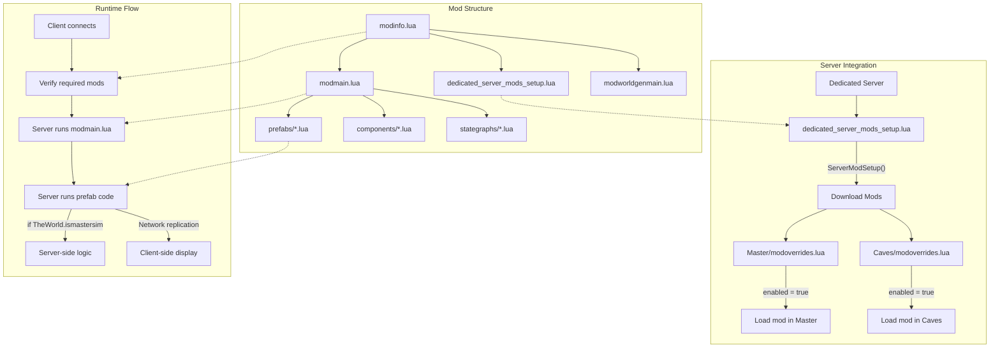

*Last Update: 2023-07-06*
# Mod Structure and Server Integration

*API Version: 619045*

This document describes the structure of Don't Starve Together mods and how they integrate with the server environment.



## Mod Directory Structure

A typical DST mod follows this directory structure:

```
modname/
├── modinfo.lua            # Mod metadata and configuration options
├── modmain.lua            # Main entry point for the mod
├── modworldgenmain.lua    # (Optional) For world generation modifications
├── dedicated_server_mods_setup.lua  # (Optional) Included for server setup convenience
├── scripts/               # Custom scripts
│   ├── prefabs/           # Custom entity definitions
│   ├── components/        # Custom components
│   └── stategraphs/       # Custom state graphs
├── anim/                  # Custom animations
├── images/                # Images and icons
│   └── inventoryimages/   # Inventory icons
├── sound/                 # Custom sound files
├── languages/             # Localization files
├── lib/                   # (Optional) External libraries
└── exported/              # (Optional) Raw exported assets
```

## Server-Side Mod Files

These files are particularly important for server integration:

### dedicated_server_mods_setup.lua

When included in a mod, this helps server administrators by providing a template for downloading the mod and its dependencies:

```lua
-- This file can be bundled with your mod to help server owners
-- Copy the lines below to the main dedicated_server_mods_setup.lua

-- Main mod
ServerModSetup("workshop-YOUR_MOD_ID")

-- Dependencies (if any)
ServerModSetup("workshop-DEPENDENCY_ID_1")
ServerModSetup("workshop-DEPENDENCY_ID_2")
```

The actual working copy is found in the server's root directory, not within individual mod folders.

### modinfo.lua Server Fields

These fields in `modinfo.lua` affect server behavior:

```lua
-- Is this mod compatible with DST?
dst_compatible = true

-- Does every client need this mod to connect?
all_clients_require_mod = true

-- Is this a client-only mod (no server components)?
client_only_mod = false

-- What version does this mod work with?
api_version = 10

-- For showing in the server browser
server_filter_tags = {
    "gameplay",
    "item"
}

-- For server admins to find related mods
mod_dependencies = {
    -- ModID of a dependency
    ["workshop-DEPENDENCY_ID"] = {
        enabled = true,
        -- Is this dependency critical?
        is_required = true
    }
}
```

## Server-Side Mod Integration

### Master Shard vs. Caves Shard

Understanding how mods integrate with different shards:

```lua
-- In modmain.lua
-- This code will run in both Master and Caves shards
AddPrefabPostInit("world", function(inst)
    if inst:HasTag("cave") then
        -- This code only runs in the Caves shard
        print("This is a cave world!")
    else
        -- This code only runs in the Master shard
        print("This is an overworld!")
    end
end)
```

### Server Authority Checking

Proper server-side code should always check for server authority:

```lua
-- In a prefab file
local function fn()
    local inst = CreateEntity()
    
    -- [Client-side entity setup]
    inst.entity:AddTransform()
    inst.entity:AddAnimState()
    inst.entity:AddNetwork()
    
    -- Network initialization
    inst.entity:SetPristine()
    
    -- Early return for clients
    if not TheWorld.ismastersim then
        return inst
    end
    
    -- Server-only components and logic
    inst:AddComponent("health")
    inst:AddComponent("combat")
    
    return inst
end
```

## Server-Client Communication

### Networked Variables

For transmitting data between server and clients:

```lua
-- In modmain.lua or a prefab file
-- On the server
inst.mynetvar = net_bool(inst.GUID, "mymod:myvar", "myvardirty")
inst.mynetvar:set(true)

-- Listening on the client
inst:ListenForEvent("myvardirty", function()
    local value = inst.mynetvar:value()
    print("Received value from server:", value)
end)
```

Available networked variable types:
- `net_byte`
- `net_shortint`
- `net_int`
- `net_uint`
- `net_float`
- `net_string`
- `net_bool`
- `net_hash`
- `net_entity`

### RPC (Remote Procedure Calls)

For executing functions across the network:

```lua
-- In modmain.lua
-- Define RPC
AddModRPCHandler("MyMod", "MyAction", function(player, target, value)
    if not TheWorld.ismastersim then return end
    
    -- This executes on the server when the RPC is received
    print(player, "triggered MyAction on", target, "with value", value)
end)

-- Send RPC from client
SendModRPCToServer(MOD_RPC.MyMod.MyAction, ThePlayer, targetEntity, 42)
```

## Server Performance Considerations

### Optimization Tips

1. **Minimize Update Functions**: Use event listeners instead of per-tick updates when possible
   ```lua
   -- Avoid this when possible
   inst:DoPeriodicTask(0, function() -- runs every frame
       -- Heavy logic
   end)
   
   -- Better approach
   inst:ListenForEvent("specific_event", function()
       -- Only runs when needed
   end)
   ```

2. **Batch Operations**: Group similar operations together
   ```lua
   -- Instead of updating positions individually
   for i=1,100 do
       entities[i].Transform:SetPosition(x[i], y[i], z[i])
   end
   ```

3. **Use Throttling**: Spread intensive operations over time
   ```lua
   local function ProcessEntity(i)
       if i <= #entities then
           -- Process entities[i]
           inst:DoTaskInTime(0.1, function() ProcessEntity(i+1) end)
       end
   end
   ProcessEntity(1)
   ```

4. **Efficient Component Use**: Only add components that are necessary
   ```lua
   -- Only add expensive components when needed
   if ShouldHaveAdvancedBehavior(inst) then
       inst:AddComponent("complexbehavior")
   else
       inst:AddComponent("simplebehavior")
   end
   ```

## Server-Safe Modding

### Thread Safety

DST runs server logic on a separate thread. Avoid using operating system functions that might block:

```lua
-- DON'T DO THIS on the server
local file = io.open("myfile.txt", "w")
file:write("This will cause issues!")
file:close()

-- Instead, use DST's built-in methods when needed
TheSim:GetPersistentString("mykey", function(success, data)
    if success then
        print("Retrieved:", data)
    end
end)
```

### Resource Management

Be mindful of resource usage, especially on dedicated servers:

1. **Texture Memory**: Reduce texture sizes and atlas usage
2. **Entity Count**: Minimize the number of active entities
3. **Update Frequency**: Reduce update frequency for distant or inactive objects
4. **Network Traffic**: Only send necessary data between server and clients 
