# modoverrides.lua Configuration

The `modoverrides.lua` file is a critical configuration file for Don't Starve Together servers that controls which mods are enabled and how they are configured.

```mermaid
flowchart TD
    subgraph "Mod Configuration Flow"
    A[Server Startup] --> B[Read dedicated_server_mods_setup.lua]
    B --> C[Download Required Workshop Mods]
    C --> D[Read Master/modoverrides.lua]
    C --> E[Read Caves/modoverrides.lua]
    D --> F[Enable & Configure Mods for Master]
    E --> G[Enable & Configure Mods for Caves]
    F --> H[Initialize Master Shard]
    G --> I[Initialize Caves Shard]
    end
    
    subgraph "modoverrides.lua Structure"
    M1["return {"] --> M2["[workshop-123456789] = {"]
    M2 --> M3["enabled = true/false"]
    M2 --> M4["configuration_options = {"]
    M4 --> M5["option1 = value1"]
    M4 --> M6["option2 = value2"]
    M6 --> M7["}"]
    M7 --> M8["}"]
    M8 --> M9["[workshop-987654321] = {"]
    M9 --> M10["..."]
    M10 --> M11["}"]
    end
    
    subgraph "Validation Process"
    V1[Client Connection] --> V2[Check all_clients_require_mod]
    V2 --> |"= true"| V3[Client must have mod]
    V2 --> |"= false"| V4[Client can connect without mod]
    V3 --> V5[Verify mod version compatibility]
    V4 --> V5
    V5 --> V6[Client connects to server]
    end
```



## File Location

Each shard in a DST server cluster has its own `modoverrides.lua` file:

```
MyDediServer/
├── Cluster_1/
│   ├── Master/
│   │   └── modoverrides.lua  # Overworld shard mod configuration
│   └── Caves/
│       └── modoverrides.lua  # Caves shard mod configuration
└── Cluster_2/
    └── ...
```

## Basic Structure

The `modoverrides.lua` file returns a Lua table with mod configurations:

```lua
return {
  -- Workshop mods use "workshop-" prefix + Workshop ID
  ["workshop-123456789"] = { 
    enabled = true 
  },
  
  -- Local mods use the folder name directly
  ["mod_folder_name"] = { 
    enabled = true 
  }
}
```

## Complete Configuration Structure

A fully-featured `modoverrides.lua` file contains:

```lua
return {
  ["workshop-123456789"] = {
    -- Whether the mod is enabled
    enabled = true,
    
    -- Mod configuration options (from modinfo.lua)
    configuration_options = {
      option1 = "value1",
      option2 = 50,
      option3 = false
    }
  },
  
  ["workshop-987654321"] = {
    enabled = false  -- Mod is installed but disabled
  },
  
  ["local_mod_folder"] = {
    enabled = true,
    configuration_options = {
      difficulty = "hard",
      spawn_rate = 0.5
    }
  }
}
```

## Configuration Options

The `configuration_options` table matches the options defined in the mod's `modinfo.lua` file:

```lua
-- In a mod's modinfo.lua
configuration_options = {
  {
    name = "difficulty",  -- This is the key used in modoverrides.lua
    label = "Difficulty", -- Display name shown to users
    options = {
      {description = "Easy", data = "easy"},
      {description = "Normal", data = "normal"},
      {description = "Hard", data = "hard"}
    },
    default = "normal"
  },
  {
    name = "spawn_rate",
    label = "Spawn Rate",
    options = {
      {description = "Low", data = 0.25},
      {description = "Medium", data = 0.5},
      {description = "High", data = 1.0}
    },
    default = 0.5
  }
}

-- In modoverrides.lua
["workshop-123456789"] = {
  enabled = true,
  configuration_options = {
    difficulty = "hard",  -- Using the 'name' field as key
    spawn_rate = 0.25     -- Value must match a 'data' field
  }
}
```

## Master vs. Caves Configuration

Each shard can have different mod configurations:

```lua
-- Master/modoverrides.lua (Overworld)
return {
  ["workshop-123456789"] = {
    enabled = true,
    configuration_options = { difficulty = "hard" }
  }
}

-- Caves/modoverrides.lua (Underground)
return {
  ["workshop-123456789"] = {
    enabled = true,
    configuration_options = { difficulty = "normal" }  -- Different setting
  },
  ["workshop-567891234"] = {
    enabled = true  -- Mod only enabled in caves
  }
}
```

## Server-Side Validation

The server applies these rules when loading mods:

1. If `all_clients_require_mod = true` in a mod's `modinfo.lua`, clients must have the mod installed to connect
2. If `client_only_mod = true`, the mod isn't loaded on the server but clients can still use it
3. Mods with dependencies may require other mods to be enabled

## Dynamic Configuration

For advanced setups, the `modoverrides.lua` file can include logic:

```lua
-- Dynamic mod configuration based on cluster name
local cluster_name = "_myClusterName_" -- Replace with actual code to get cluster name

local config = {
  ["workshop-123456789"] = { enabled = true }
}

-- Add PvP mods for specific clusters
if cluster_name:find("PvP") then
  config["workshop-PVP_MOD_ID"] = { enabled = true }
end

-- Adjust difficulty based on cluster name
if cluster_name:find("Hard") then
  config["workshop-123456789"].configuration_options = { difficulty = "hard" }
elseif cluster_name:find("Easy") then
  config["workshop-123456789"].configuration_options = { difficulty = "easy" }
else
  config["workshop-123456789"].configuration_options = { difficulty = "normal" }
end

return config
```

## Troubleshooting

Common issues with `modoverrides.lua`:

1. **Syntax Errors**: Ensure proper Lua syntax with all brackets and commas
2. **Invalid Options**: Make sure option values match those defined in `modinfo.lua`
3. **Mod Compatibility**: Some mods may conflict when enabled together
4. **Different Shard Configurations**: Ensure compatible settings between Master and Caves

## Best Practices

1. **Consistent Configurations**: Unless necessary, keep mod settings consistent across shards
2. **Version Your Configurations**: Back up working configurations before making changes
3. **Test Before Deployment**: Verify mod combinations work before using on a production server
4. **Document Special Settings**: Keep notes about non-default mod settings and their purpose
5. **Regular Updates**: Review and update mod configurations after game or mod updates 
