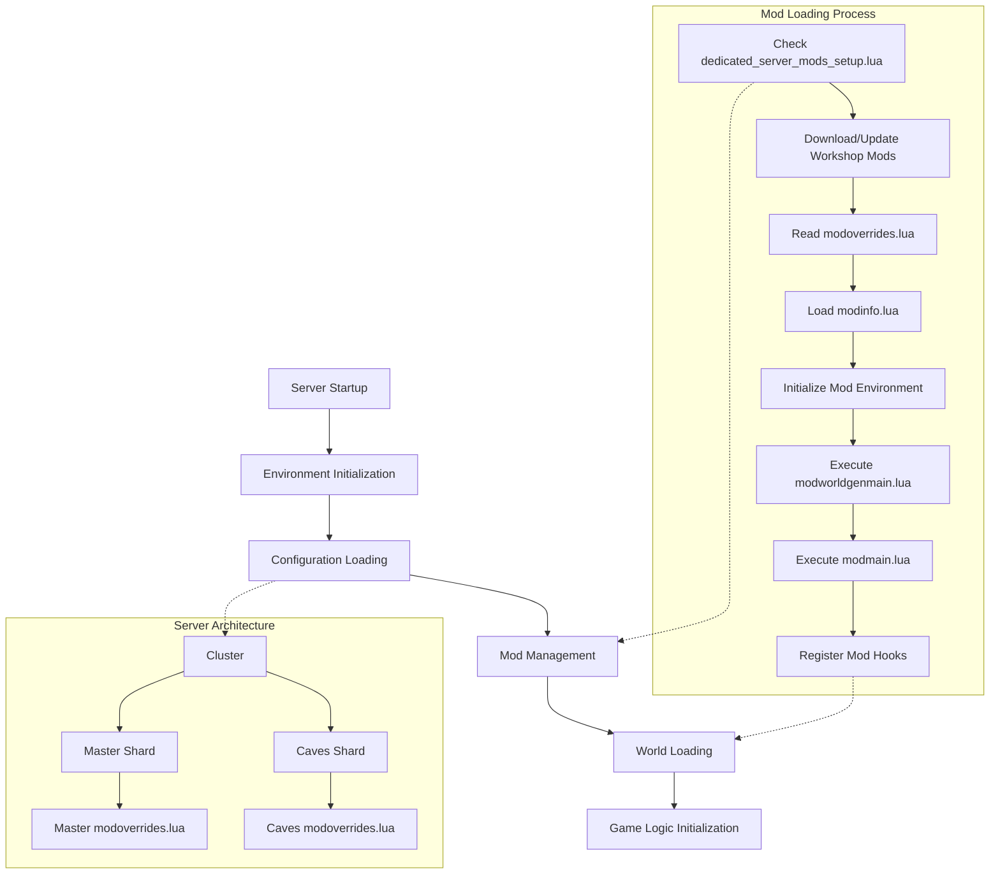

# Server Startup Process

This document describes the startup sequence of Don't Starve Together dedicated servers, with a focus on mod loading and initialization.



## Server Architecture

DST servers operate using a cluster-based architecture:

- **Cluster**: The overall server installation, containing configuration files and multiple shards
- **Shards**: Individual server instances (Master/Caves) that run within a cluster
  - **Master Shard**: The main overworld shard, required for every server
  - **Caves Shard**: Optional underground world shard

Each shard runs as a separate process but shares configuration data from the cluster.

## Startup Sequence

The server follows this general startup sequence:

1. **Environment Initialization**
   - Load system libraries and core game files
   - Initialize global variables and namespaces
   - Setup logging and error handling

2. **Configuration Loading**
   - Read cluster and shard configuration files
   - Process command line arguments
   - Setup networking parameters

3. **Mod Management**
   - Download and update required mods
   - Verify mod integrity
   - Initialize mod environment

4. **World Loading**
   - Load or generate world data
   - Initialize world entities
   - Setup world systems (weather, seasons, etc.)

5. **Game Logic Initialization**
   - Initialize state graphs
   - Setup event handlers
   - Prepare for client connections

## Mod Loading Process

Mods are loaded in a specific sequence during server startup:

### 1. Mod Setup and Download

The server first checks `dedicated_server_mods_setup.lua` located in the server's root directory. This file contains `ServerModSetup()` function calls that tell the server which Workshop mods to download:

```lua
-- Example dedicated_server_mods_setup.lua
ServerModSetup("workshop-1185229307") -- Example Workshop item ID
ServerModSetup("workshop-1595631294") -- Another Workshop item ID
```

During this phase, the server:
- Downloads missing mods from the Steam Workshop
- Updates existing mods to their latest versions
- Creates symbolic links in the game's mods directory

### 2. Mod Configuration

After downloading, the server reads shard-specific mod configuration from `modoverrides.lua` located in each shard's directory:

```lua
-- Example modoverrides.lua
return {
  ["workshop-1185229307"] = { 
    enabled = true,
    configuration_options = {
      option1 = "value1",
      option2 = "value2"
    }
  },
  ["workshop-1595631294"] = { enabled = true }
}
```

Each shard can have its own mod configuration, allowing different mods to be active in different shards (Master vs Caves).

### 3. Mod Initialization

The server then initializes enabled mods in this order:

1. Load each mod's `modinfo.lua` to get metadata
2. Initialize mod environment and globals
3. Execute `modworldgenmain.lua` if present (affects world generation)
4. Execute `modmain.lua` for each enabled mod in load order
5. Register mod hooks, prefabs, recipes, etc.

## Performance Considerations

The server startup process, especially mod loading, can impact server startup time and performance:

- Large numbers of mods will increase startup time
- Mods with complex initialization code may delay startup
- World generation mods are processed first and can significantly affect startup time
- Server memory usage scales with the number and complexity of loaded mods

## Troubleshooting

Common issues during server startup:

1. **Missing Mods**: Verify the Workshop IDs in `dedicated_server_mods_setup.lua`
2. **Mod Conflicts**: Check for incompatible mods or conflicting hooks
3. **Startup Crashes**: Review server logs for error messages related to specific mods
4. **Performance Issues**: Consider reducing the number of mods or optimizing mod code

## Best Practices

For mod developers and server administrators:

- Keep `modmain.lua` lightweight; defer heavy operations until needed
- Use the appropriate mod flags in `modinfo.lua` (`client_only_mod`, `all_clients_require_mod`)
- Implement proper version checking in mods to handle game updates
- Test mods thoroughly in both dedicated server and client-hosted environments 