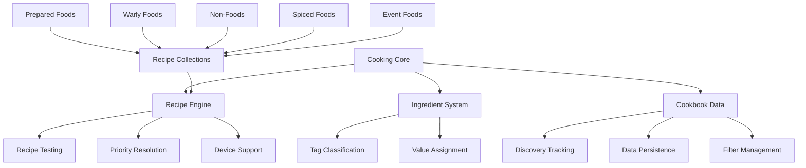

# Cooking Overview

## Build Information
Current documentation based on build version: **676042**
Last updated: **2025-06-21**

## System Purpose

The Cooking Systems category implements comprehensive ingredient processing, recipe calculation, and food preparation mechanics in Don't Starve Together. These systems transform raw ingredients into prepared foods through sophisticated recipe matching, cooking device management, and cookbook integration, providing players with nutritional benefits, special effects, and survival advantages.

## Key Concepts

### Ingredient Classification System
The cooking system uses a tag-based ingredient classification where each cookable item receives specific tags (meat, veggie, fruit, etc.) with associated values. This allows for flexible recipe matching where recipes can require minimum amounts of ingredient categories rather than specific items.

### Recipe Priority and Selection
Multiple recipes can match the same ingredient combination, resolved through a priority system where higher-priority recipes take precedence. This enables specialized recipes to override generic fallbacks while maintaining backward compatibility.

### Multi-Device Support
The system supports various cooking devices (cookpots, portable cookpots, spicers) with shared recipe pools and device-specific exclusive recipes, allowing for character specialization and unique cooking experiences.

### Dynamic Recipe Generation
Special systems like spiced foods automatically generate variants of base recipes with enhanced effects, expanding the cooking repertoire without manual recipe definition for each combination.

## Recent Changes

| Build | Date | Component | Change Type | Description |
|----|---|-----|----|----|
| 676042 | 2025-06-21 | [Cooking](./cooking.md) | stable | Core cooking system with mod integration |
| 676042 | 2025-06-21 | [Cookbook Data](./cookbookdata.md) | stable | Recipe discovery and persistence system |
| 676042 | 2025-06-21 | [Prepared Foods](./preparedfoods.md) | stable | Standard cookpot recipes collection |
| 676042 | 2025-06-21 | [Prepared Foods Warly](./preparedfoods_warly.md) | stable | Warly-exclusive portable cookpot recipes |
| 676042 | 2025-06-21 | [Prepared Non-Foods](./preparednonfoods.md) | stable | Non-food cookpot utility recipes |
| 676042 | 2025-06-21 | [Spiced Foods](./spicedfoods.md) | stable | Automatic spiced food variant generation |
| 676042 | 2025-06-21 | [Winter's Feast Foods](./wintersfeastcookedfoods.md) | stable | Holiday event cooking configuration |

## Common Usage Patterns

### Basic Recipe Calculation
```lua
local cooking = require("cooking")
local recipe_name, cooktime = cooking.CalculateRecipe("cookpot", 
    {"meat", "meat", "berries", "twigs"})
-- Returns: "meatballs", 1
```

### Ingredient Registration
```lua
-- Add new cooking ingredients with tag values
cooking.AddIngredientValues({"custom_item"}, {veggie = 1, magic = 0.5}, true, false)
```

### Recipe Discovery Tracking
```lua
local CookbookData = require("cookbookdata")
-- Learn new recipe when food is cooked
CookbookData:AddRecipe("meatballs", {"meat", "meat", "berries", "twigs"})
-- Record food stats when consumed
CookbookData:LearnFoodStats("meatballs")
```

## Architecture Overview

### Core Components



### Data Flow

1. **Ingredient Processing**: Raw items → tag classification → cooking values
2. **Recipe Matching**: Ingredient collection → recipe testing → priority resolution
3. **Cooking Execution**: Recipe selection → cook time calculation → product creation
4. **Discovery Learning**: Recipe usage → cookbook entry → data persistence

## Modules

| Module | Status | Description |
|-----|-----|----|
| [Cooking](./cooking.md) | stable | Core cooking system with ingredient management and recipe calculation |
| [Cookbook Data](./cookbookdata.md) | stable | Recipe discovery tracking and persistent storage system |
| [Prepared Foods](./preparedfoods.md) | stable | Standard cookpot recipes with 60+ food definitions |
| [Prepared Foods Warly](./preparedfoods_warly.md) | stable | Warly-exclusive portable cookpot recipes with unique effects |
| [Prepared Non-Foods](./preparednonfoods.md) | stable | Utility recipes for crafting equipment and special items |
| [Spiced Foods](./spicedfoods.md) | stable | Automatic generation of spiced food variants with buffs |
| [Winter's Feast Foods](./wintersfeastcookedfoods.md) | stable | Holiday event food configuration and cooking times |

## Integration Points

### Component Integration
- **Container Component**: Validates cookable ingredients using `IsCookingIngredient()`
- **Cookpot Component**: Uses recipe calculation for cooking operations
- **Stewer Component**: Implements cooking device behavior and timing

### Prefab Integration
- **Food Prefabs**: Created based on recipe names and properties
- **Ingredient Prefabs**: Tagged with cooking values for recipe matching
- **Cookware Prefabs**: Support specific recipe pools and cooking behaviors

### UI Integration
- **Cookbook Interface**: Displays discovered recipes and food statistics
- **Cookpot UI**: Shows available recipes based on current ingredients
- **Recipe Cards**: Provide ingredient requirements and cooking guidance

## Technical Architecture

### Recipe Resolution Algorithm
1. **Ingredient Analysis**: Convert ingredient list to name counts and tag totals
2. **Recipe Testing**: Test all recipes for current cooker type against ingredients
3. **Priority Filtering**: Group valid recipes by priority level (highest first)
4. **Selection**: Choose recipe based on priority and optional weighted randomization

### Ingredient Tag System
- **Hierarchical Classification**: Items have multiple tags with fractional values
- **Cooked Variants**: Automatically generated with "precook" tag
- **Dried Variants**: Automatically generated with "dried" tag
- **Ocean Fish Integration**: Dynamic ingredient values from fish definitions

### Mod Support Framework
- **Recipe Registration**: `AddCookerRecipe()` for custom recipes
- **Ingredient Extension**: `AddIngredientValues()` for custom ingredients
- **Cookbook Integration**: Automatic categorization of mod vs official content
- **Save Compatibility**: Mod recipe exclusion from online synchronization

## Performance Characteristics

### Optimization Features
- **Lazy Recipe Loading**: Recipes loaded only when cooker types are accessed
- **Efficient Testing**: Recipe tests optimized for common ingredient patterns
- **Cached Calculations**: Ingredient value calculations cached per item type
- **Bounded Storage**: Cookbook recipe storage limited to prevent memory bloat

### Scalability Considerations
- **Recipe Limit Management**: Maximum 6 recipes per food in cookbook
- **Priority System**: Prevents recipe conflicts with deterministic resolution
- **Memory Management**: Efficient storage of ingredient tags and recipe data
- **Network Efficiency**: Compact encoding for online cookbook synchronization

## Development Guidelines

### Adding New Recipes
1. **Define Test Function**: Create ingredient matching logic
2. **Set Appropriate Priority**: Avoid conflicts with existing recipes
3. **Assign Proper Tags**: Use correct ingredient classification
4. **Test Thoroughly**: Validate against various ingredient combinations

### Extending Ingredient System
1. **Use Existing Tags**: Prefer existing tag types for consistency
2. **Balance Values**: Maintain proportional ingredient values
3. **Consider Variants**: Account for cooked/dried versions if applicable
4. **Document Classifications**: Clear documentation of tag usage

### Cookbook Integration
1. **Category Assignment**: Proper cookbook categorization
2. **Card Definitions**: Provide recipe cards for UI display
3. **Effect Descriptions**: Clear descriptions of special effects
4. **Visual Integration**: Appropriate build overrides and animations

## Error Handling

### Recipe Validation
- **Ingredient Verification**: Validation of ingredient existence and properties
- **Test Function Safety**: Robust error handling in recipe test functions
- **Priority Conflicts**: Warning systems for recipe priority overlaps

### Save System Integration
- **Data Corruption Recovery**: Graceful handling of corrupted cookbook data
- **Version Migration**: Support for cookbook data format changes
- **Mod Compatibility**: Safe handling of mod recipe additions and removals

## Future Extensibility

### Planned Enhancements
- **Advanced Recipe Logic**: Support for more complex ingredient relationships
- **Dynamic Cooking Times**: Recipe-specific cooking time modifications
- **Enhanced Effects System**: More sophisticated food effect stacking
- **Cookbook Analytics**: Player cooking behavior tracking and statistics

### Mod Integration Roadmap
- **Custom Cooker Types**: Framework for entirely new cooking device types
- **Advanced Ingredient Properties**: Support for custom ingredient attributes
- **Recipe Dependency System**: Recipes that require other recipes as ingredients
- **Community Recipe Sharing**: Infrastructure for sharing custom recipes

---

*This overview covers the Cooking Systems category as of build 676042. The cooking system provides the foundation for all food preparation mechanics, from basic ingredient processing to advanced recipe creation and discovery tracking.*
